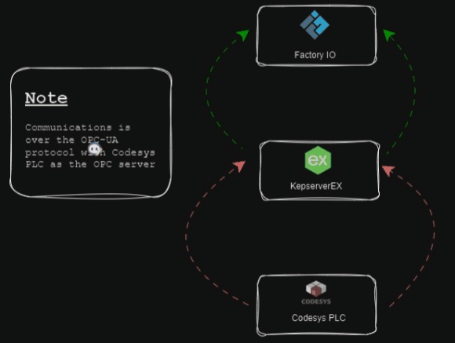
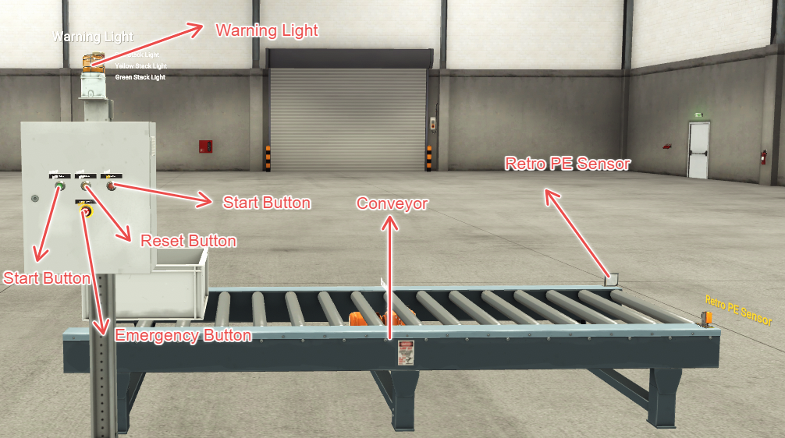
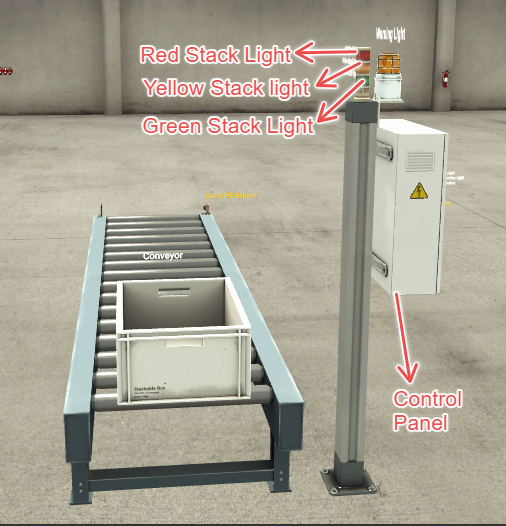
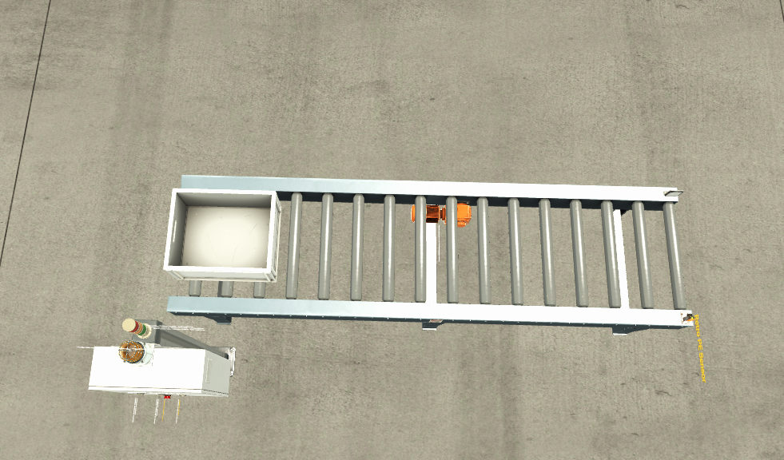
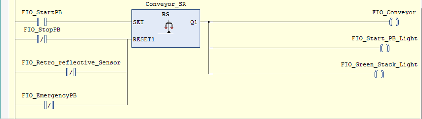
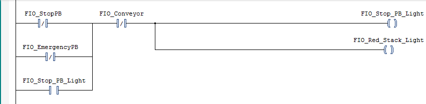
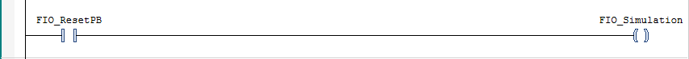
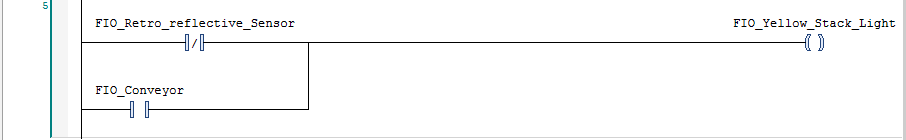

# FactoryIO A to B Scene Documentation + Codesys PLC 💻

## Overview

This documentation provides details about the integration of FactoryIO with Codesys as the PLC for the 🏭 FactoryIO's  A to B scene with a focus on real-world applications and tailored modifications.

## Table of Contents

1. [Introduction](#introduction) 🌐
2. [System Architecture](#system-architecture) 🛠️
3. [Setup](#setup) 
    - [Prerequisites](#prerequisites) 📋
    - [Configuration](#configuration) ⚙️
4. [PLC Programming](#plc-programming) 💻
5. [FactoryIO Configuration](#factoryio-configuration) 🏭
6. [Simulation](#simulation) 🚀
7. [Troubleshooting](#troubleshooting) 🛠️
8. [Contributing](#contributing) 🤝

## Introduction

# FactoryIO A to B Scene Integration with Codesys

**Introduction:**

Welcome to the intricate world of industrial automation, where precision meets efficiency. This documentation serves as your guide to the integration of FactoryIO with Codesys, specifically tailored for the 🏭 FactoryIO's A to B scene. In the realm of industrial applications, the A to B scenario symbolizes a fundamental process: the seamless transfer of goods or materials from one point to another.

**Context in Industrial Applications:**

In the realm of manufacturing, the A to B movement is quintessential, representing various processes such as assembly lines, material handling, and logistics. Imagine a production line where raw materials smoothly transition from processing stations to final product assembly, mirroring the orchestrated dance of machinery in a real-world industrial setting. This integration aims to simulate and optimize such scenarios, ensuring a virtual representation that aligns closely with the intricacies of industrial workflows.

**Examples:**

1. **Assembly Lines:** In an automotive assembly plant, components move from station A to station B, each step contributing to the creation of a finished vehicle.

2. **Material Handling:** Warehouses employ A to B systems for efficient movement of goods, ensuring timely and organized delivery to the intended destinations.

3. **Logistics Optimization:** In a distribution center, optimizing the flow of products from the receiving dock (A) to the shipping area (B) is crucial for timely dispatch.

By delving into the FactoryIO's A to B scene, we embark on a journey to explore and enhance these industrial processes, mirroring real-world complexities and challenges for a richer and more immersive simulation experience.


## System Architecture

| Component              | Description                                               |
|------------------------|-----------------------------------------------------------|
|   | Codesys PLC: Responsible for logic and control.            |
|  | FactoryIO: Simulates the industrial environment.          |
|  | KepserveeEX: OPC-UA Client(Links FactoryIO to PLC).          |

*Figure 1: System Architecture*

**Communication Flow in the System Architecture:**

In the intricately woven tapestry of FactoryIO, KepserverEx, and Codesys PLC, a synchronized dance of data ensures the seamless orchestration of industrial automation. Let's unravel the communication flow that propels this synergy:

1. **FactoryIO to KepserverEx:**
   - **Data Generation:** Within FactoryIO, dynamic scenarios unfold as it generates realistic data representing the industrial environment, from conveyor movements to sensor inputs.
   - **Communication Initiation:** This data is then transmitted to KepserverEx, a robust industrial communication platform, establishing a vital link between the virtual world of FactoryIO and the data processing hub.

2. **KepserverEx to Codesys PLC:**
   - **Data Translation:** KepserverEx undertakes the responsibility of translating the incoming data into a language understood by Codesys PLC, ensuring seamless compatibility.
   - **Data Transmission:** The translated data is then relayed to the Codesys PLC, acting as the digital maestro orchestrating logic and control operations.

3. **Codesys PLC to FactoryIO:**
   - **Control Logic Execution:** Codesys PLC executes control logic based on the received data, influencing the behavior of the simulated industrial processes.
   - **Feedback to FactoryIO:** The PLC communicates feedback and control signals back to FactoryIO, closing the loop of interaction and mirroring the bidirectional nature of real-world industrial systems.

This communication triad forms a dynamic cycle, where data generated in FactoryIO influences the actions of the Codesys PLC, and the subsequent control signals from the PLC shape the ongoing simulation within FactoryIO.

Architecture  Diagram




*Figure 2: FactoryIO Setup Diagram*

## Setup
The diagram above encapsulates the essence of the FactoryIO setup, illustrating the interconnected nodes of FactoryIO, KepserverEx, and Codesys PLC. Arrows denote the flow of data, showcasing the synergy that drives the simulation forward.

For a detailed view, you can explore the high-resolution .


### Prerequisites 📋

- FactoryIO 🏭
- KepserverEx ⚙️
- Codesys PLC 💻


### Configuration ⚙️

Tutorial on  how to configure the environment to run the FactoryIO scene with Codesys as the PLC. Include steps for setting up communication between FactoryIO and Codesys with KepserverEX.


!! Feel free to use UA-Expert or any OPC-UA client as  it will work just as well.
[Watch the Tutorial](https://www.youtube.com/watch?v=wAZV-5Db2Rc)


## PLC Programming 💻

Provide details about the Codesys programming for the PLC. Include code snippets, explanations, and any specific configurations required for the integration.

### FactoryIO Scenes

#### Side View



*Figure 2: FactoryIO Side View*

#### Front View



*Figure 3: FactoryIO Front View*

#### Top View



*Figure 4: FactoryIO Top View*

```codesys
VAR
    //**********INPUTS ***********//
	//This are push buttons 
	FIO_StartPB      : BOOL; //COLOR GREEN
	FIO_StopPB       : BOOL;  //COLOR RED
	FIO_ResetPB      : BOOL;  //COLOR YELLOW Resets the simulation environment
	FIO_EmergencyPB   :BOOL;
	//Sensor
	FIO_Retro_reflective_Sensor :BOOL;
	
	//**** End ****//
	
	//**************OUTPUTS**********//
	FIO_Start_PB_Light  : BOOL; //push button light 
	FIO_Stop_PB_Light   : BOOL; //push button light
	//FIO_Reset_PB_Light  : BOOL; //push button light
	
	//Stack lights
	FIO_Green_Stack_Light   : BOOL;
	FIO_Red_Stack_Light     : BOOL;
	FIO_Yellow_Stack_Light  : BOOL; 
	
	//
	FIO_Conveyor            : BOOL;
	FIO_Warning_Light       : BOOL;
	FIO_Simulation          : BOOL;
	
	//***End***//
	// SET AND RESET Function block for controlling the conveyor
	Conveyor_SR: RS;
	// Reset -Set Function Block for the conveyor runnng warning lights
	Warning_Light_SR: RS;
END_VAR
```
## PLC Program Logic Overview 🧠

**Start Logic:**
- When the 🚀 Start Pushbutton is pressed:
  - 🏭 Conveyor starts and remains on.
  - 💡 Start Button Light and 🟢 Green Stack Light are turned on when the conveyor is on.
  - They remain on unless the ⛔ Stop Pushbutton, 🚨 Emergency Pushbutton, or 🔄 Retroreflective PE Sensor is blocked.

**Stop Logic:**
- When the ⛔ Stop Pushbutton or 🚨 Emergency Pushbutton is pressed and the conveyor is off:
  - 🔴 Stop Light and 🔴 Red Stack Light are turned on.
  - They are latched to stay on until reset.

**Reset Logic:**
- When the 🔄 Reset Pushbutton is pressed:
  - The simulation is reset.

**Warning Lights Logic:**
- The ⚠️ Warning Lights are turned on when the conveyor is on.
- They are reset when the conveyor is off.

**Yellow Stack Light Logic:**
- The 💛 Yellow Stack Light is on when:
  - The conveyor is on or
  - The 🔄 Retroreflective PE Sensor is blocked.

This logic orchestrates the behavior of the PLC, ensuring a dynamic and responsive control system for the simulated industrial environment. 🛠️✨
## PLC Program Screenshots 🖥️

### Start Logic


### Stop Logic


### Reset Logic


### Warning Lights Logic


### Yellow Stack Light Logic



